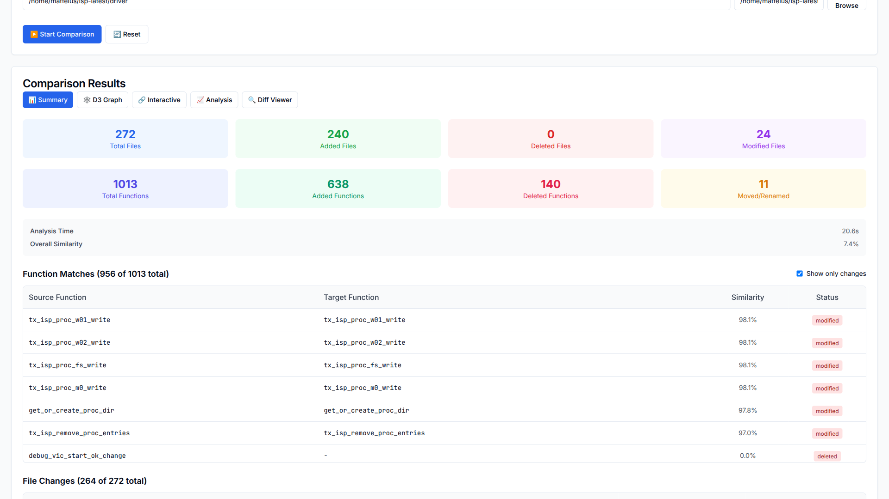
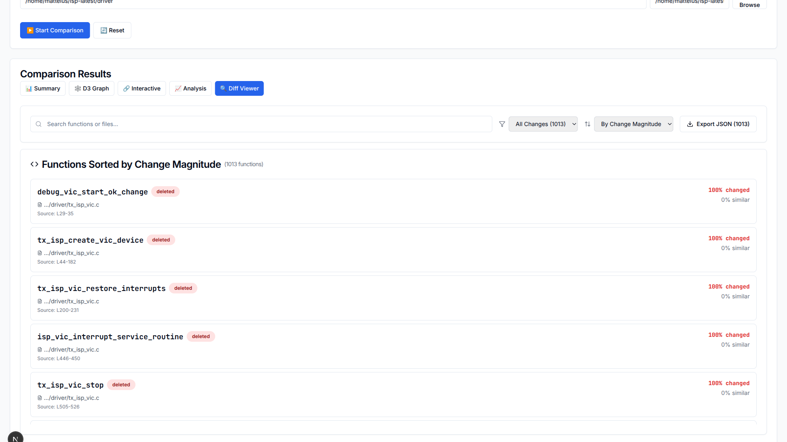
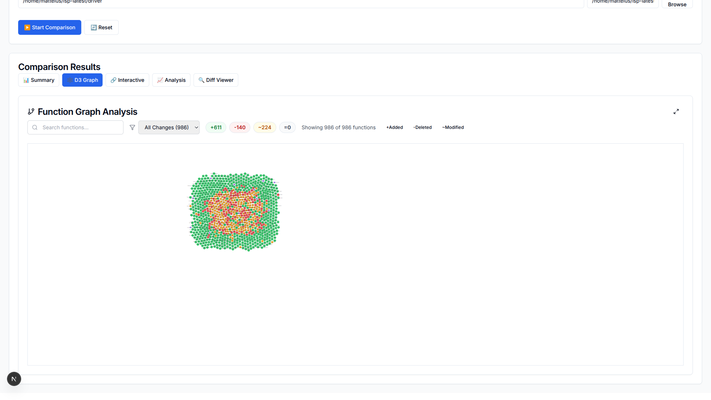
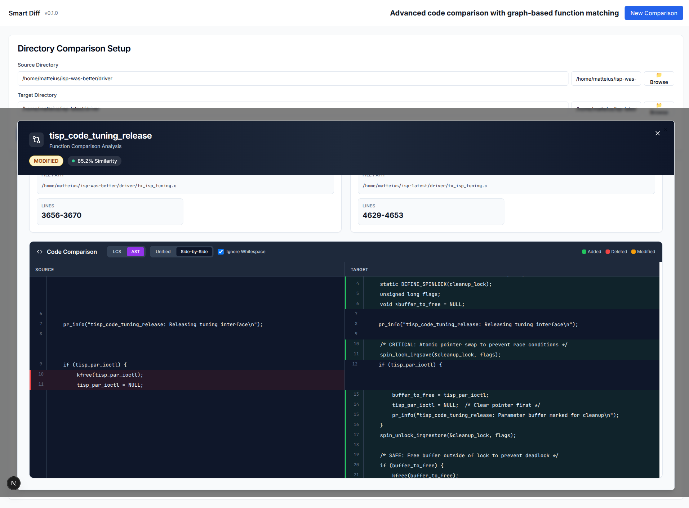

# Smart Code Diff

A next-generation code comparison tool that performs structural and semantic analysis of source code files using Abstract Syntax Tree (AST) level comparison, going far beyond traditional line-based diff tools.

## 🚀 Features

### Advanced Code Analysis
- **Structural Comparison**: AST-level analysis instead of line-by-line comparison
- **Semantic Understanding**: Symbol resolution and type information extraction
- **Multi-Language Support**: Java, Python, JavaScript, C++, C
- **Function Matching**: Intelligent function correspondence across file versions
- **Refactoring Detection**: Automatic identification of common refactoring patterns

### Multiple Interfaces
- **Command Line Interface**: Comprehensive CLI with multiple output formats
- **Web Interface**: Modern React-based UI with interactive visualizations
- **REST API**: Full-featured API for programmatic integration
- **MCP Server**: Model Context Protocol server for AI agent integration

### Visualization Modes
- **Side-by-Side View**: Synchronized code comparison with change highlighting
- **Unified Diff View**: Traditional diff format with enhanced context
- **Structure View**: AST-level structural comparison
- **Function-Centric View**: Detailed function-level analysis with similarity scores

## 📸 Product Screenshots

### Diff Overview - Summary View
The summary view provides a comprehensive overview of all changes, with functions sorted by change magnitude (most changed first). See statistics on total functions, changes, and detailed breakdowns by change type.



### Function Diff View
Detailed side-by-side or unified diff view showing exact code changes within functions. Includes syntax highlighting and intelligent change detection at the AST level.



### Interactive Graph Visualization
Visual graph representation of function relationships and matches between source and target codebases. Nodes represent functions, with color coding for change types and interactive zoom/pan capabilities.



### Detailed Function Diff - Modified Function
Focused view of a specific modified function showing the detailed diff with syntax highlighting. Filter by change type (modified, added, deleted, renamed, moved) and click any function to see its complete diff with line-by-line changes.



## 📦 Installation

### Prerequisites
- Rust 1.75+ (for building from source)
- Node.js 18+ (for web interface)

### One-Command Install (Recommended)

```bash
# Clone and install everything
git clone https://github.com/opensensor/smartdiff.git
cd smartdiff
./install.sh
```

This will:
- ✓ Check prerequisites
- ✓ Install frontend dependencies
- ✓ Build the backend
- ✓ Make scripts executable

### Manual Installation

```bash
# Clone the repository
git clone https://github.com/opensensor/smartdiff.git
cd smartdiff

# Build the backend
cargo build --release --bin smart-diff-server

# Install frontend dependencies
cd nextjs-frontend
npm install
cd ..
```


## 🎯 Quick Start

### Start Both Services (Easiest)

**Linux / macOS:**
```bash
./start.sh
# or
make start
```

**Windows:**
```cmd
start.bat
```

Then open your browser to:
- **Frontend:** http://localhost:3000
- **Backend API:** http://localhost:8080

### Development Mode

For active development with hot-reload:

```bash
./dev.sh        # Linux/macOS
make dev-start  # Using Makefile
```

### Stop Services

```bash
./stop.sh       # Linux/macOS
stop.bat        # Windows
make stop       # Using Makefile
```

### CLI Usage

**Compare two files:**
```bash
cargo run --bin smart-diff -- compare Calculator.java Calculator_refactored.java
```

**Compare directories:**
```bash
cargo run --bin smart-diff -- compare-dir src/ src-refactored/ --recursive
```

**Generate HTML report:**
```bash
cargo run --bin smart-diff -- compare --output html old.py new.py > report.html
```

**JSON output for automation:**
```bash
cargo run --bin smart-diff -- compare --output json file1.js file2.js | jq '.similarity'
```

### Web Interface

The web interface is automatically started with `./start.sh` or `start.bat`.

Alternatively, start manually:

**Backend:**
```bash
cargo run --bin smart-diff-server
# Runs on http://localhost:8080
```

**Frontend:**
```bash
cd nextjs-frontend
npm run dev
# Runs on http://localhost:3000
```

### API Integration

```bash
# Compare files via REST API
curl -X POST http://localhost:3000/api/compare \
  -H "Content-Type: application/json" \
  -d '{
    "file1": {"path": "old.java", "content": "..."},
    "file2": {"path": "new.java", "content": "..."},
    "options": {"threshold": 0.7, "detect_moves": true}
  }'
```

## 🤖 MCP Server for AI Agents

Smart Diff provides a Model Context Protocol (MCP) server that allows AI agents like Claude to perform intelligent code comparisons.

### Quick Setup for Claude Desktop

1. **Build the MCP server:**
   ```bash
   cargo build --release -p smart-diff-mcp-server
   ```

2. **Configure Claude Desktop:**

   Edit your Claude Desktop config file:
   - **macOS**: `~/Library/Application Support/Claude/claude_desktop_config.json`
   - **Windows**: `%APPDATA%\Claude\claude_desktop_config.json`
   - **Linux**: `~/.config/Claude/claude_desktop_config.json`

   Add the smart-diff server:
   ```json
   {
     "mcpServers": {
       "smart-diff": {
         "command": "/absolute/path/to/codediff/target/release/smart-diff-mcp",
         "args": [],
         "env": {
           "RUST_LOG": "info"
         }
       }
     }
   }
   ```

3. **Restart Claude Desktop** and verify the tools are available.

### Quick Setup for Augment Code (VS Code)

For Augment Code, we recommend using the SSE (Server-Sent Events) bridge to avoid timeout issues with large comparisons:

1. **Install Python dependencies:**
   ```bash
   cd crates/mcp-server
   pip install aiohttp
   # or with pipenv:
   pipenv install aiohttp
   ```

2. **Start the SSE bridge:**
   ```bash
   cd crates/mcp-server
   ./start_sse_bridge.sh
   # or manually:
   python3 sse_bridge.py --binary ../../target/release/smart-diff-mcp --port 8011
   ```

3. **Configure Augment:**

   Edit: `~/.config/Code/User/globalStorage/augment.vscode-augment/augment-global-state/mcpServers.json`

   Add or update the smart-diff entry:
   ```json
   {
     "type": "sse",
     "name": "smart-diff",
     "url": "http://127.0.0.1:8011/sse",
     "id": "your-unique-id-here",
     "tools": [],
     "disabled": false
   }
   ```

4. **Restart VS Code** or toggle the server in Augment's MCP settings.

### Available MCP Tools

The MCP server provides four main tools:

- **`compare_locations`**: Compare two code locations (files or directories)
- **`list_changed_functions`**: List functions sorted by change magnitude
- **`get_function_diff`**: Get detailed diff for a specific function
- **`get_comparison_summary`**: Get summary statistics for a comparison

### Example Usage with AI Agents

Once configured, you can ask your AI agent:

```
Compare /old/src with /new/src and show me the top 5 most changed functions
```

```
Analyze the code changes between these directories and identify any refactoring patterns
```

```
Compare these two versions and explain what changed in the authentication logic
```

For detailed MCP setup instructions, see:
- [MCP Server README](crates/mcp-server/README.md)
- [Claude Desktop Setup](crates/mcp-server/CLAUDE_SETUP.md)
- [Augment SSE Bridge Setup](crates/mcp-server/SSE_SETUP.md)

### Troubleshooting MCP Setup

**Server not appearing in Claude/Augment:**
- Verify the binary path is absolute and correct
- Check file permissions: `chmod +x target/release/smart-diff-mcp`
- Review logs in the AI client's log directory

**SSE Bridge issues (Augment):**
- Check if bridge is running: `curl http://127.0.0.1:8011/health`
- Verify Python dependencies: `pip install aiohttp`
- Check port availability (default: 8011)
- View bridge logs in the terminal where it's running

**Comparison timeouts:**
- For large codebases, use the SSE bridge instead of stdio
- Increase timeout settings in your AI client if available
- Consider comparing smaller directory subsets

## 🏗️ Architecture

Smart Code Diff follows a modular architecture with clear separation of concerns:

```
┌─────────────┐  ┌─────────────┐  ┌─────────────┐  ┌─────────────┐
│   Web UI    │  │     CLI     │  │  REST API   │  │ MCP Server  │
│ (React/TS)  │  │   (Rust)    │  │   (Axum)    │  │   (Rust)    │
└─────────────┘  └─────────────┘  └─────────────┘  └─────────────┘
       │                │                 │                │
       └────────────────┼─────────────────┼────────────────┘
                        │                 │
                        │    ┌────────────┘
                        │    │
         ┌──────────────────────────────────────────────┐
         │              Core Engine                     │
         │  • Smart Matcher  • Change Classifier        │
         │  • Refactoring Detector  • Impact Analyzer   │
         └──────────────────────────────────────────────┘
                        │
    ┌───────────┬───────┼───────┬───────────┬──────────┐
    │           │       │       │           │          │
┌───▼───┐  ┌───▼───┐ ┌─▼──┐ ┌──▼────┐ ┌───▼────┐ ┌───▼────┐
│Parser │  │Semantic│ │Diff│ │Function│ │Change  │ │Refactor│
│Engine │  │Analysis│ │Algo│ │Matcher │ │Classify│ │Detector│
└───────┘  └───────┘ └────┘ └────────┘ └────────┘ └────────┘
```

### Core Components

- **Parser Engine**: Tree-sitter based multi-language parsing
- **Semantic Analysis**: Symbol resolution and type extraction
- **Diff Engine**: Zhang-Shasha tree edit distance algorithm
- **Function Matcher**: Hungarian algorithm for optimal matching
- **Change Classifier**: Intelligent change categorization
- **Refactoring Detector**: Pattern recognition for common refactorings

## 📊 Example Output

### Text Output
```
File Comparison: Calculator.java → Calculator.java
Language: java
Overall Similarity: 87.5%

Function Analysis:
├── add (100% match) - unchanged
├── multiply (100% match) - unchanged
├── isEven → isNumberEven (75% match) - renamed
└── subtract (new) - added

Changes Detected:
├── Function renamed: isEven → isNumberEven
├── Method extracted: checkEvenness
└── Function added: subtract

Refactoring Patterns:
└── Extract Method (92% confidence)
    └── Logic extracted from isNumberEven to checkEvenness
```

### JSON Output
```json
{
  "similarity": 0.875,
  "analysis": {
    "functions": {
      "total_functions": 4,
      "matched_functions": 3,
      "average_similarity": 0.92
    },
    "changes": {
      "total_changes": 3,
      "change_types": {
        "renamed": 1,
        "added": 1,
        "extracted": 1
      }
    },
    "refactoring_patterns": [
      {
        "pattern": "extract_method",
        "confidence": 0.92,
        "description": "Logic extracted from isNumberEven to checkEvenness"
      }
    ]
  }
}
```

## 🔧 Configuration

Smart Code Diff supports flexible configuration through multiple methods:

### Global Configuration (`~/.smart-diff/config.toml`)
```toml
[parser]
max_file_size = 10485760  # 10MB
parse_timeout = 30

[diff_engine]
default_similarity_threshold = 0.7
enable_refactoring_detection = true

[output]
default_format = "text"
enable_colors = true
```

### Project Configuration (`.smart-diff.toml`)
```toml
[project]
name = "My Project"
exclude_patterns = ["**/test/**", "**/*.generated.*"]

[analysis]
complexity_threshold = 15
duplicate_threshold = 0.85
```

## 🧪 Use Cases

### Code Review
- Analyze pull request changes with structural understanding
- Identify refactoring patterns vs. functional changes
- Generate comprehensive change reports

### Refactoring Analysis
- Track large-scale refactoring impacts
- Verify refactoring tool outputs
- Measure code evolution over time

### Migration Projects
- Compare implementations across languages
- Analyze architectural changes
- Validate migration completeness

### Quality Assessment
- Detect code duplication
- Measure complexity changes
- Track technical debt evolution

## 📚 Documentation

- **[User Guide](docs/user-guide.md)**: Comprehensive usage documentation
- **[API Documentation](docs/api/)**: REST API reference and integration guide
- **[Developer Guide](docs/developer-guide.md)**: Architecture and contribution guidelines
- **[Configuration Reference](docs/configuration.md)**: Detailed configuration options
- **[Examples](examples/)**: Practical usage examples and tutorials

### MCP Server Documentation

- **[MCP Server README](crates/mcp-server/README.md)**: Overview and features
- **[Claude Desktop Setup](crates/mcp-server/CLAUDE_SETUP.md)**: Step-by-step Claude configuration
- **[Augment SSE Bridge Setup](crates/mcp-server/SSE_SETUP.md)**: Python bridge for Augment Code
- **[MCP Usage Guide](crates/mcp-server/MCP_USAGE.md)**: Detailed tool documentation

## 🤝 Contributing

We welcome contributions! Please see [CONTRIBUTING.md](CONTRIBUTING.md) for details. Note: all contributors must sign our CLA (handled via CLA Assistant on GitHub). See [CLA.md](CLA.md) for the terms you agree to when contributing.

### Development Setup
```bash
# Clone and setup
git clone https://github.com/opensensor/smartdiff.git
cd smartdiff

# Install dependencies
cargo build
cd frontend && npm install

# Run tests
cargo test
npm test

# Start development server
cargo run -p smart-diff-web &
cd frontend && npm run dev
```

### Code Style
- Follow Rust formatting: `cargo fmt`
- Use Clippy for linting: `cargo clippy`
- Write comprehensive tests
- Follow conventional commits

## 📈 Performance

Smart Code Diff is optimized for performance with:

- **Parallel Processing**: Multi-threaded analysis for large codebases
- **Intelligent Caching**: Multi-level caching for repeated operations
- **Memory Efficiency**: Streaming processing for large files
- **Algorithmic Optimizations**: Heuristic pruning and early termination

### Benchmarks
- **Large Files**: 10MB+ files processed in seconds
- **Directory Comparison**: 1000+ files analyzed in parallel
- **Memory Usage**: Efficient memory management with configurable limits

## 🛡️ Security

- Input validation and sanitization
- Resource limits to prevent DoS attacks
- Sandboxed execution environments
- No code execution, only analysis

## 📄 License

- Open Source: AGPL-3.0-only (prevents closed-source SaaS forks). See [LICENSE](LICENSE).
- Commercial: Non-AGPL licenses available for companies wanting to integrate or embed without open-sourcing. Contact: matt@opensensor.io.

## 🙏 Acknowledgments

- [Tree-sitter](https://tree-sitter.github.io/) for parsing infrastructure
- [Zhang-Shasha Algorithm](https://doi.org/10.1137/0218082) for tree edit distance
- [Hungarian Algorithm](https://en.wikipedia.org/wiki/Hungarian_algorithm) for optimal matching
- The Rust and React communities for excellent tooling and libraries

## 📞 Support

- **Documentation**: Check the [docs/](docs/) directory
- **Issues**: Report bugs on [GitHub Issues](https://github.com/opensensor/smartdiff/issues)
- **Discussions**: Join [GitHub Discussions](https://github.com/opensensor/smartdiff/discussions)
- **Email**: matt@opensensor.io

---

**Smart Code Diff** - Revolutionizing code comparison with structural and semantic analysis. 🚀
