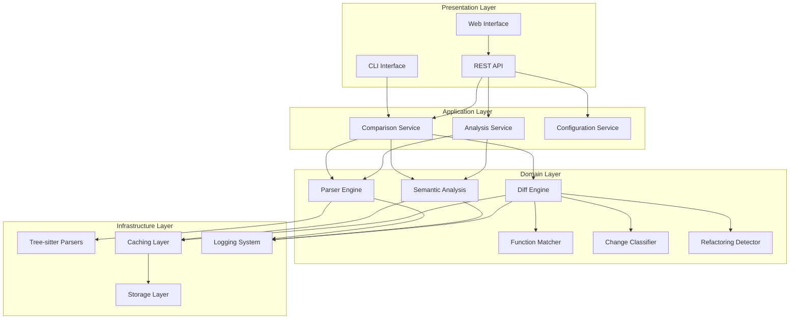
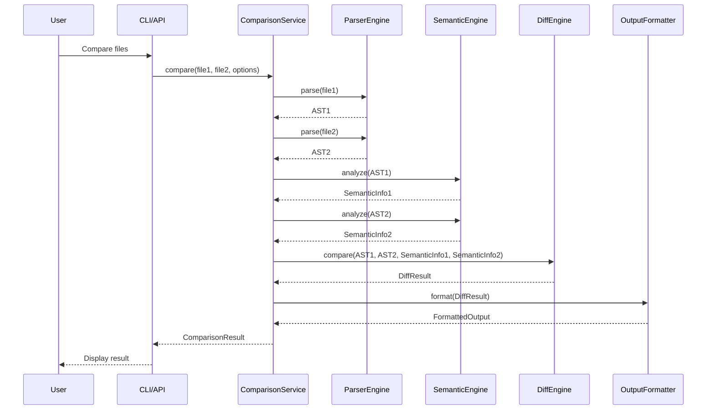
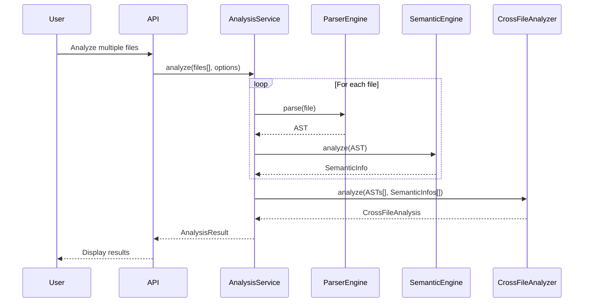

# Smart Code Diff Architecture

This document provides a detailed technical overview of the Smart Code Diff system architecture, design decisions, and implementation details.

## Table of Contents

- [System Overview](#system-overview)
- [Component Architecture](#component-architecture)
- [Data Flow](#data-flow)
- [Core Algorithms](#core-algorithms)
- [Design Patterns](#design-patterns)
- [Performance Architecture](#performance-architecture)
- [Security Considerations](#security-considerations)
- [Scalability Design](#scalability-design)

## System Overview

Smart Code Diff is designed as a modular, high-performance code analysis system that provides structural and semantic comparison of source code files. The architecture follows clean architecture principles with clear separation between business logic, infrastructure, and presentation layers.

### High-Level Architecture



### Key Architectural Principles

1. **Separation of Concerns**: Each component has a single, well-defined responsibility
2. **Dependency Inversion**: High-level modules don't depend on low-level modules
3. **Interface Segregation**: Clients depend only on interfaces they use
4. **Open/Closed Principle**: Open for extension, closed for modification
5. **Single Responsibility**: Each class/module has one reason to change

## Component Architecture

### 1. Parser Engine

**Responsibility**: Convert source code into normalized Abstract Syntax Trees (AST)

**Components**:
- **Language Detector**: Identifies programming language from file content and extension
- **Parser Factory**: Creates appropriate parser instances for detected languages
- **AST Builder**: Converts tree-sitter parse trees into normalized AST representation
- **Error Recovery**: Handles parsing errors gracefully with partial AST construction

**Design Pattern**: Factory Pattern + Strategy Pattern

```rust
pub struct ParserEngine {
    language_detector: Box<dyn LanguageDetector>,
    parser_factory: Box<dyn ParserFactory>,
    ast_builder: Box<dyn ASTBuilder>,
    error_recovery: Box<dyn ErrorRecovery>,
}

impl ParserEngine {
    pub fn parse(&self, content: &str, file_path: &str) -> Result<AST, ParseError> {
        let language = self.language_detector.detect(content, file_path)?;
        let parser = self.parser_factory.create_parser(&language)?;
        let parse_tree = parser.parse(content)?;
        
        match self.ast_builder.build(parse_tree, content) {
            Ok(ast) => Ok(ast),
            Err(e) => self.error_recovery.recover(e, content, parse_tree),
        }
    }
}
```

### 2. Semantic Analysis Engine

**Responsibility**: Extract semantic information from AST

**Components**:
- **Symbol Resolver**: Builds symbol tables and resolves references
- **Type Extractor**: Extracts type information and type relationships
- **Dependency Graph Builder**: Constructs dependency relationships between code elements
- **Context Analyzer**: Analyzes code context and usage patterns

**Design Pattern**: Visitor Pattern + Chain of Responsibility

```rust
pub struct SemanticEngine {
    analyzers: Vec<Box<dyn SemanticAnalyzer>>,
    cache: Arc<RwLock<SemanticCache>>,
}

impl SemanticEngine {
    pub fn analyze(&self, ast: &AST) -> Result<SemanticInfo, AnalysisError> {
        let cache_key = ast.hash();
        
        if let Some(cached) = self.cache.read().unwrap().get(&cache_key) {
            return Ok(cached.clone());
        }
        
        let mut semantic_info = SemanticInfo::new();
        
        for analyzer in &self.analyzers {
            let analysis_result = analyzer.analyze(ast)?;
            semantic_info.merge(analysis_result);
        }
        
        self.cache.write().unwrap().insert(cache_key, semantic_info.clone());
        Ok(semantic_info)
    }
}
```

### 3. Diff Engine

**Responsibility**: Compare ASTs and detect structural changes

**Components**:
- **Tree Edit Distance Calculator**: Implements Zhang-Shasha algorithm
- **Function Matcher**: Matches functions between file versions using Hungarian algorithm
- **Similarity Scorer**: Calculates multi-dimensional similarity scores
- **Change Classifier**: Categorizes changes (add, delete, modify, move, rename)
- **Refactoring Detector**: Identifies common refactoring patterns

**Design Pattern**: Strategy Pattern + Template Method

```rust
pub struct DiffEngine {
    tree_edit_calculator: Box<dyn TreeEditCalculator>,
    function_matcher: Box<dyn FunctionMatcher>,
    similarity_scorer: Box<dyn SimilarityScorer>,
    change_classifier: Box<dyn ChangeClassifier>,
    refactoring_detector: Box<dyn RefactoringDetector>,
    config: DiffConfig,
}

impl DiffEngine {
    pub fn compare(&self, source_ast: &AST, target_ast: &AST) -> Result<DiffResult, DiffError> {
        // Template method pattern
        let edit_distance = self.calculate_edit_distance(source_ast, target_ast)?;
        let function_matches = self.match_functions(source_ast, target_ast)?;
        let similarity_scores = self.calculate_similarity(source_ast, target_ast, &function_matches)?;
        let changes = self.classify_changes(&function_matches, &edit_distance)?;
        let refactoring_patterns = self.detect_refactoring(&changes, &function_matches)?;
        
        Ok(DiffResult {
            edit_distance,
            function_matches,
            similarity_scores,
            changes,
            refactoring_patterns,
        })
    }
}
```

## Data Flow

### 1. File Comparison Flow



### 2. Multi-File Analysis Flow



## Core Algorithms

### 1. Zhang-Shasha Tree Edit Distance

**Purpose**: Calculate minimum cost to transform one tree into another

**Implementation**: Dynamic programming with optimizations for code trees

```rust
impl ZhangShashaCalculator {
    pub fn calculate_distance(&self, tree1: &AST, tree2: &AST) -> f64 {
        let nodes1 = tree1.post_order_traversal();
        let nodes2 = tree2.post_order_traversal();
        
        let mut dp = vec![vec![0.0; nodes2.len() + 1]; nodes1.len() + 1];
        
        // Initialize base cases
        for i in 0..=nodes1.len() {
            dp[i][0] = i as f64 * self.delete_cost;
        }
        for j in 0..=nodes2.len() {
            dp[0][j] = j as f64 * self.insert_cost;
        }
        
        // Fill DP table
        for i in 1..=nodes1.len() {
            for j in 1..=nodes2.len() {
                let delete_cost = dp[i-1][j] + self.delete_cost;
                let insert_cost = dp[i][j-1] + self.insert_cost;
                let substitute_cost = dp[i-1][j-1] + 
                    self.substitute_cost(&nodes1[i-1], &nodes2[j-1]);
                
                dp[i][j] = delete_cost.min(insert_cost).min(substitute_cost);
            }
        }
        
        dp[nodes1.len()][nodes2.len()]
    }
}
```

### 2. Hungarian Algorithm for Function Matching

**Purpose**: Find optimal bipartite matching between functions

**Implementation**: Kuhn-Munkres algorithm with similarity matrix

```rust
impl HungarianMatcher {
    pub fn match_functions(&self, source_funcs: &[Function], target_funcs: &[Function]) 
        -> Vec<FunctionMatch> {
        
        let similarity_matrix = self.build_similarity_matrix(source_funcs, target_funcs);
        let assignments = self.hungarian_algorithm(&similarity_matrix);
        
        assignments.into_iter()
            .filter(|(_, _, similarity)| *similarity >= self.threshold)
            .map(|(i, j, similarity)| FunctionMatch {
                source_function: source_funcs[i].clone(),
                target_function: target_funcs[j].clone(),
                similarity,
                match_type: self.classify_match(&source_funcs[i], &target_funcs[j]),
            })
            .collect()
    }
    
    fn hungarian_algorithm(&self, matrix: &[Vec<f64>]) -> Vec<(usize, usize, f64)> {
        // Kuhn-Munkres algorithm implementation
        // ... detailed implementation
    }
}
```

### 3. Multi-Dimensional Similarity Scoring

**Purpose**: Calculate comprehensive similarity between code elements

**Components**:
- **Signature Similarity** (40%): Function names, parameters, return types
- **Body Similarity** (40%): AST structure and content
- **Context Similarity** (20%): Usage patterns and dependencies

```rust
impl SimilarityScorer {
    pub fn calculate_similarity(&self, func1: &Function, func2: &Function) -> SimilarityScore {
        let signature_sim = self.calculate_signature_similarity(func1, func2);
        let body_sim = self.calculate_body_similarity(func1, func2);
        let context_sim = self.calculate_context_similarity(func1, func2);
        
        let overall = signature_sim * 0.4 + body_sim * 0.4 + context_sim * 0.2;
        
        SimilarityScore {
            overall,
            signature: signature_sim,
            body: body_sim,
            context: context_sim,
        }
    }
}
```

## Design Patterns

### 1. Strategy Pattern

Used extensively for pluggable algorithms:
- Different parsing strategies for different languages
- Multiple similarity calculation strategies
- Various output formatting strategies

### 2. Factory Pattern

Used for creating instances based on runtime conditions:
- Parser factory creates language-specific parsers
- Analyzer factory creates appropriate semantic analyzers
- Formatter factory creates output formatters

### 3. Observer Pattern

Used for progress reporting and event handling:
- Progress observers for long-running operations
- Event listeners for analysis completion
- Status change notifications

### 4. Template Method Pattern

Used for defining algorithm skeletons:
- Diff computation workflow
- Analysis pipeline execution
- Report generation process

### 5. Visitor Pattern

Used for traversing complex data structures:
- AST traversal for analysis
- Semantic information extraction
- Change detection across tree structures

## Performance Architecture

### 1. Caching Strategy

**Multi-Level Caching**:
- **L1 Cache**: In-memory LRU cache for frequently accessed ASTs
- **L2 Cache**: Disk-based cache for parsed files
- **L3 Cache**: Distributed cache for shared analysis results

```rust
pub struct CacheManager {
    l1_cache: Arc<RwLock<LruCache<String, AST>>>,
    l2_cache: Arc<DiskCache>,
    l3_cache: Option<Arc<DistributedCache>>,
}

impl CacheManager {
    pub async fn get_ast(&self, file_hash: &str) -> Option<AST> {
        // Try L1 cache first
        if let Some(ast) = self.l1_cache.read().unwrap().get(file_hash) {
            return Some(ast.clone());
        }
        
        // Try L2 cache
        if let Some(ast) = self.l2_cache.get(file_hash).await {
            self.l1_cache.write().unwrap().put(file_hash.to_string(), ast.clone());
            return Some(ast);
        }
        
        // Try L3 cache if available
        if let Some(l3) = &self.l3_cache {
            if let Some(ast) = l3.get(file_hash).await {
                self.l1_cache.write().unwrap().put(file_hash.to_string(), ast.clone());
                self.l2_cache.put(file_hash, &ast).await;
                return Some(ast);
            }
        }
        
        None
    }
}
```

### 2. Parallelization Architecture

**Thread Pool Management**:
- Dedicated thread pools for different operation types
- Work-stealing queues for load balancing
- Async/await for I/O operations

```rust
pub struct ParallelProcessor {
    parsing_pool: ThreadPool,
    analysis_pool: ThreadPool,
    comparison_pool: ThreadPool,
}

impl ParallelProcessor {
    pub async fn process_files(&self, files: Vec<FileInfo>) -> Vec<ProcessingResult> {
        let parsing_tasks: Vec<_> = files.into_iter()
            .map(|file| {
                let pool = self.parsing_pool.clone();
                tokio::spawn(async move {
                    pool.spawn_with_handle(|| parse_file(file)).await
                })
            })
            .collect();
        
        let parsed_results = futures::future::join_all(parsing_tasks).await;
        
        // Continue with analysis and comparison in parallel
        // ...
    }
}
```

### 3. Memory Management

**Streaming Processing**:
- Memory-mapped files for large file access
- Streaming parsers for huge files
- Incremental AST construction

**Memory Pools**:
- Object pools for frequently allocated structures
- Custom allocators for specific data types
- Memory usage monitoring and limits

## Security Considerations

### 1. Input Validation

- File size limits to prevent DoS attacks
- Content validation to prevent malicious code execution
- Path traversal protection for file operations

### 2. Resource Limits

- CPU time limits for parsing operations
- Memory usage limits per analysis
- Concurrent operation limits

### 3. Sandboxing

- Isolated execution environments for parsing
- Limited file system access
- Network access restrictions

## Scalability Design

### 1. Horizontal Scaling

**Microservices Architecture**:
- Separate services for parsing, analysis, and comparison
- Load balancing across service instances
- Service discovery and health monitoring

### 2. Vertical Scaling

**Resource Optimization**:
- Efficient memory usage patterns
- CPU-intensive operation optimization
- I/O operation batching and caching

### 3. Database Scaling

**Analysis Result Storage**:
- Sharded databases for large-scale storage
- Read replicas for query performance
- Caching layers for frequently accessed data

This architecture provides a solid foundation for a scalable, maintainable, and extensible code analysis system that can handle diverse use cases from individual file comparison to large-scale codebase analysis.
